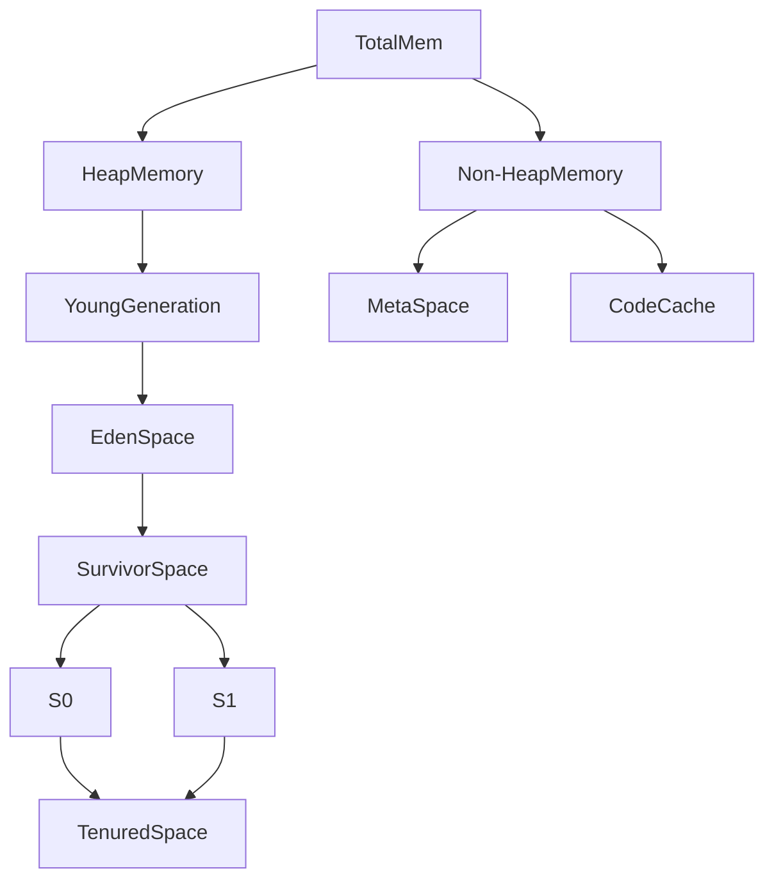

### Understanding memory in java
https://dzone.com/articles/understanding-the-java-memory-model-and-the-garbag
### JVM parameters
https://www.baeldung.com/jvm-parameters
### GC collector
https://www.baeldung.com/jvm-garbage-collectors
### Tanserveruning memory
https://docs.oracle.com/cd/E13150_01/jrockit_jvm/jrockit/geninfo/diagnos/memman.html
### Tools
https://www.betsol.com/blog/java-memory-management-for-java-virtual-machine-jvm/
### PermGen vs MetaSpace
https://www.baeldung.com/java-permgen-metaspace
### Adjusting Memory
https://www.ibm.com/docs/en/configurepricequote/9.4.0?topic=guidelines-adjusting-jvm-memory-settings
https://docs.oracle.com/cd/E15523_01/web.1111/e13814/jvm_tuning.htm#PERFM150
http://download.oracle.com/javase/1.5.0/docs/tooldocs/linux/java.html
https://www.oracle.com/technetwork/java/javase/tech/memorymanagement-whitepaper-1-150020.pdf
Create command GUI
https://jvmmemory.com/


## Como funciona la memoria de la JVM

### Elementos
+ **HeapMemory**: Donde se guardan los objetos
+ **YoungGeneration**: Se compone del EdenSpace y SurvivorSpace (a veces llamado NurserySpace)
+ **EdenSpace**: Guarda el objeto nada más ser creado.
+ **SurvivorSpace**: Son los objetos que han sobrevivido de MinorGC (llamado también YoungGC). Existen dos espacios de mismo tamaño llamados S0 y S1
+ **TenuredSpace**: Son los objetos que sobreviven a MinorGC, son "permanentes". Tambiés se le llama "Old Generation Space".
+ **MetaSpace**: antiguamente "Perm Gen Space", es donde se guardan las definiciones de las clases. Está diseñada para crecer indistintamente de la RAM del host, para evitar errores de memoria. Problema: puede suponer swapping y una bajada del rendimiento.
+ **CodeCache**: Se almacena el código compilado utilizado de forma frecuente. Para no estar recompilandolo a cada rato.

Cuando arranca la JVM se usa la EdenSpace, cuando se llena se inicia un Minor GC, el cual mueve los objetos activos a un SurvivorSpace, S0 o S1, según toque (va haciendo un roundrobin). Y le pone una etiqueta de tiempo con vida, que a cada ciclo de GC incrementa en 1.

Los objetos activos que no quepan en el SurvivorSpace los mueve a la TernuredSpace, esta acción se conoce como "Premature promotion". Una vez acaba el Minor GC libera el EdenSpace.

Cuando el TernuredSpace se llena la JVM ejecuta un Major GC, que a veces también limpia el MetaSpace si no hay objetos en la HeapMemory creados partir de las clases que se han almacenado.

**Cuando** puede darse un GC:
+ El desarrollador puede instanciar GC: `System.gc() && Runtime.getRunTime().gc()`
+ Cuando se acaba el TernuredSpace
+ Cuando el MinorGC no puede reclamar suficiente memoria
+ Si marcamos un ***MaxMetaspaceSize*** muy pequeño

## Parametros
+ _**-XX:MaxTenuringThreshold**_ : defecto 15, la vida máxima antes de ser movido al TernuredSpace
+ **Tipos de GC**: 
	+ ***-XX:+UseSerialGC***: Para todos los Threads al ejecutar el GC, no es buena idea usarlo en webservices
	+ ***-XX:+UseParallelGC***: Por defecto, habilita la recolección de los multi-thread
		+ ***-XX:ParallelGCThreads=(N)***: Numero de threads encargados del GC
		+ ***-XX:MaxGCPauseMillis=(N)***: Tiempo mínimo que debe pasar entre GC
		+ ***-XX:GCTimeRatio=(N)***: Ratio que puede estar en estado de GC y no
	+ ***-XX:+UseParNewGC***: No es buena idea si dentro del código se invoca el GC. Tiene los días contados 
	+ ***-XX:+UseG1GC***: Pensado para nodos con varios cores y muchos recursos. Divide los spaces en partes iguales, y va haciendo GC y moviendo objetos según su vida a los otros heaps
	+ ***-XX:+UseZGC***: GC experimental a partir de Java11
+ ***-Xms(heap size)(unit)***: Mínimo de memoria para la HeapMemory  
+ ***-Xmx(heap size)(unit)***: Máximo de memeoria asignada para la HeapMemory
+ ***-XX:PermGen***: Define el tamaño del MetaSpace, antiguamente PermGen
+ ***-XX:MaxMetaspaceSize=(metaspace size)(unit)***: Máximo de memoria asignada a al MetaSpace. Equivalente a ***-XX:MaxPermSize***
+ ***-XX:NewSize=(young size)(unit)***: Memoria asignada al YoungSpace al arrancar
+ ***-XX:MaxNewSize=(young size)(unit)***: Límite de memoria asignada al YoungSpace al arrancar
+ **Log de GC:**
	+ ***-XX:+UseGCLogFileRotation***: Habilita el rotado de logs del GC 
	+ ***-XX:NumberOfGCLogFiles=(number of log files)***: Máximo de ficheros a retener
	+ ***-XX:GCLogFileSize=(file size)(unit)***: Máximo de tamaño por fichero
	+ ***-Xloggc:/path/to/gc.log***: Ubicación del fichero de log
	+ ***-XX:+PrintGC***: Muestra en el catalina.out el GC 
	+ ***-XX:+PrintGCDetails*** 
	+ ***-XX:+PrintGCTimeStamps***
+ **Out of memory**
	+ ***-XX:+HeapDumpOnOutOfMemoryError***: Habilita el dump de memoria al quedarse sin memoria
	+ ***-XX:HeapDumpPath=./java_pid(pid).hprof:*** Path donde ubicara el dump
	+ ***-XX:OnOutOfMemoryError="(cmd args);(cmd args)"***: Acciones a ejecutar cuando se de el out of memory
	+ ***-XX:+UseGCOverheadLimit***: Limita cada cuando se puede hacer un GC cuando se llena la memoria
+ ***-d(OS bit)***: Definir los bits del SO
+ _**-server**_: Define el tipo de compilador, (también existe el -client, pero rinde menos)
+ _**-XX:+UseStringDeduplication**_: Desde Java8u20 lo implementan para ahorrar memoria a la hora de almacenar strings duplicadas
+ _**-XX:+UseLWPSynchronization**_: Habilita la sincronización LWP de las políticas en lugar de por threads
+ **_-XX:LargePageSizeInBytes_**: Define el tamaño de la página de la memoria
+ _**-XX:MaxHeapFreeRatio**_: Define el porcentaje máximo de HeapMemory libre tras el GC, evita quedarte sin espacio tras el GC
+ _**-XX:MinHeapFreeRatio**_: Define el porcentaje mínimo de HeapMemory libre tras el GC, evitar cargarte cosas que puedan interesarte
+ _**-XX:SurvivorRatio**_: Define el ratio de objetos que son movidos de EdenSpace o SurvivorSpace al aplicar el GC
+ _**-XX:+UseLargePages**_: Habilita la utilización de páginas de memoria más grandes si son soportadas por la JVM (Java7 tiende a petar)
+ **_-XX:+UseStringCache_**: Habilita el cache de las strings del String pool
+ _**-XX:+UseCompressedStrings**_: Aplica tipo byte[] para strings que pueden ser representadas en puro ASCII
+ **_-XX:+OptimizeStringConcat_**: Optimiza la concatenación de strings cuando es posible
+ ***-XX+CMSClassUnloadingEnabled:*** Permite el sweeping de la permgen (MetaSpace), debe ir acompañado de ***-XX+UseConcMarkSweepGC*** para que se aplique (Java 5-7)

#### Java jrockit
+ ***-XX:keepAreaRatio:(percentage)***: porcentaje de la cantidad de objetos que se mantienen en el YoungSpace
+ ***-Xns(heap size)(unit)***: memoria asignada al YoungSpace

#### Habilitar jmx debugging
- ***-Dcom.sun.management.jmxremote***
- ***-Dcom.sun.management.jmxremote.port=(port)***
+ ***-Dcom.sun.management.jmxremote.rmi.port=9999"***
+ ***-Dcom.sun.management.jmxremote.ssl=false"***
+ ***-Dcom.sun.management.jmxremote.authenticate=true"***
+ ***-Dcom.sun.management.jmxremote.access.file=vía_acceso_archivo_acceso/jmxremote.access"***
+ ***-Dcom.sun.management.jmxremote.password.file=vía_acceso_archivo_contraseña/jmxremote.password"***
+ ***-Dcom.sun.management.jmxremote.local.only=false***

## Configuración memoria


## Comandos útiles

### Jstat
```shell
<JAVA_HOME>/bin/jstat –gc <JAVA_PID>
```

S0C	Current survivor space 0 capacity (KB)
S1C	Current survivor space 1 capacity (KB)
S0U	Survivor space 0 utilization (KB)
S1U	Survivor space 1 utilization (KB)
EC	Current eden space capacity (KB)
EU	Eden space utilization (KB)
OC	Current old space capacity (KB)
OU	Old space utilization (KB)
MC	Metasapce capacity (KB)
MU	Metaspace utilization (KB)
CCSC	Compressed class space capacity (KB)
CCSU	Compressed class space used (KB)
YGC	Number of young generation garbage collection events
YGCT	Young generation garbage collection time
FGC	Number of full GC events
FGCT	Full garbage collection time
GCT	Total garbage collection time

### Jmap

```shell
<JAVA_HOME>/bin/jmap –heap <JAVA_PID>
```

![[Pasted image 20230322162049.png]]

### Dump de memoria Jcmd
```shell
jcmd <JAVA_PID> GC.heap_dump filename=<FILE>
```

